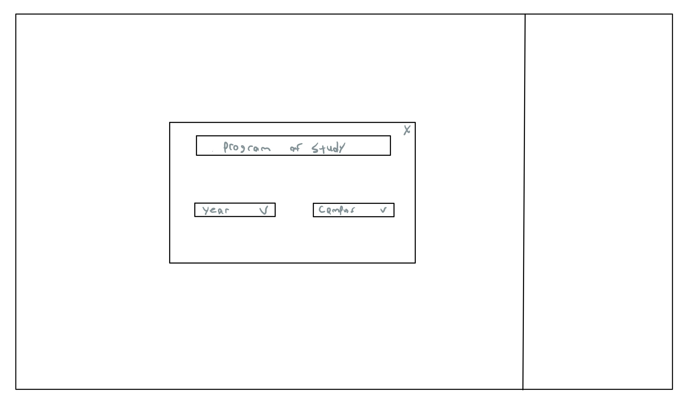
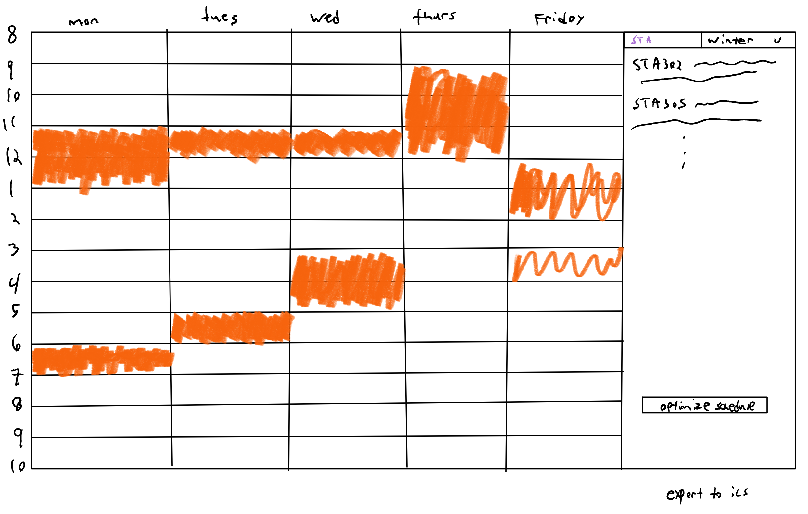

Since our project is a timetable planner, the user interface isn't very complicated. It aims to streamline choosing courses for the year by integrating tasks that students generally do when choosing courses such as:

    1. Finding out which courses are mandatory for your program
    3. Searching for "bird" courses
    2. Looking up the professors that teach the courses you want to take
    4. Optimizing your schedule to your liking.

Users will be greeted by a screen asking them for their campus, program of study and year. This will then automatically find which courses they must complete and add those accordingly. 

Adding courses will just be done by searching (on the right), courses will pop up, then students can click them to get more information. Here  we will include ratings from ratemyprofessors. They can also filter by "bird" courses, which will be obtained by scraping bird course facebook groups. Additionally, they can filter courses by program, time, breadth requirement. Added courses will show up on the timetable on the left. Students will also be able to export their calendar(ics format) when they've completed their schedule.

Probably the best feature of our timetable will be the ability to optimize the schedule, students can select which days they would prefer to go and then we will check to see if it's possible to meet program and breadth requirements with a shorter week.

